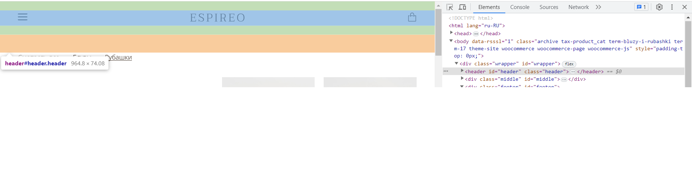
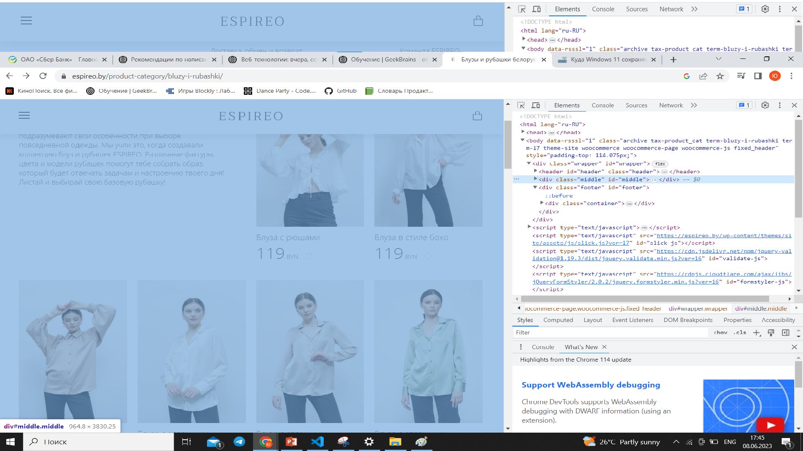

# **На основе сайта**
- Определите, на каком протоколе работает сайт.
- Проанализируйте структуру страницы сайта.
- Внесите не менее 3 изменений на страницу с помощью инструмента разработчика и представьте скриншоты было/стало.
- Создайте прототип низкой детализации (дополнительное задание, если на семинаре дошли до задания №8).

# Для выполнения первого домашнего задания выбрала сайт https://espireo.by/

1. Сайт работает на протоколе https.
2. Структура страницы сайта:

*Шапка (header)*

*Зона контента:*

*Зона виджетов:*

Отсутствует. Контакты расположены в footer.

*Подвал (footer):*

3. 3 изменения на странице сайта с помощью инструмента разработчика:

Фрагмент сайта ДО изменений

Изменила цвет текста

Изменила размер текста

Изменила фон 

Прототип низкой детализации 

